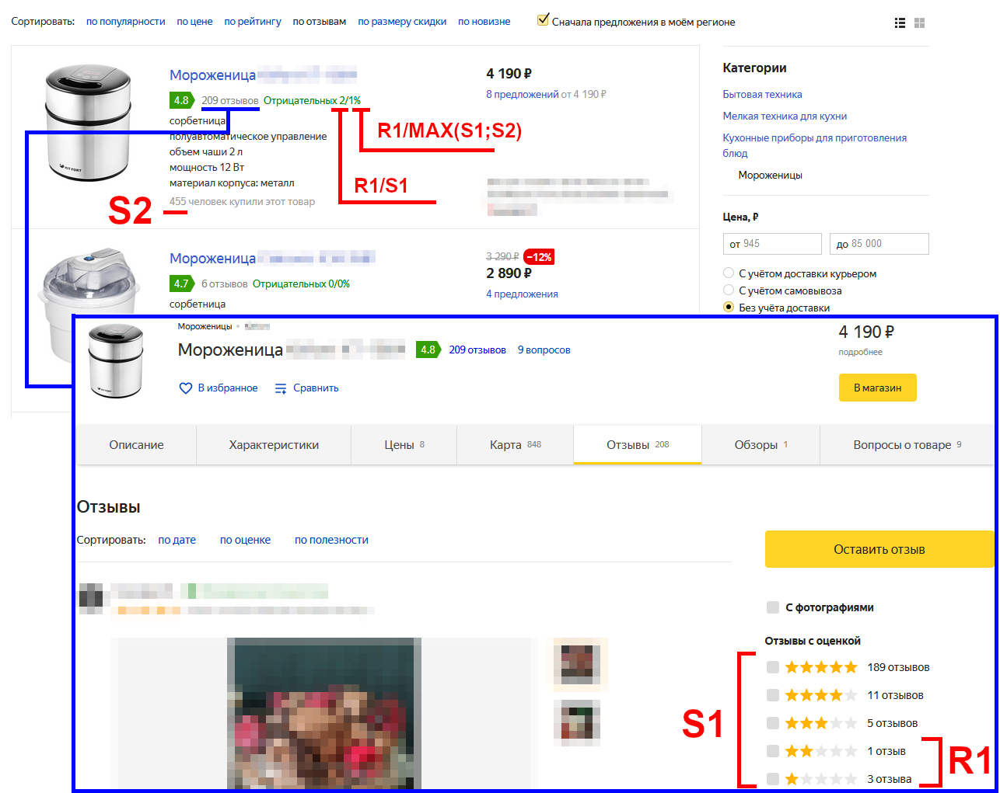

# greasemonkey-scripts

Greasemonkey scripts (.user.js browser scripts).

See [Greasemonkey_Manual:Installing_Scripts](https://wiki.greasespot.net/Greasemonkey_Manual:Installing_Scripts).

## Feedly.user.js

This script enhances Title-Only View:
* removes all flying panels
* moves Article Description to the next line

Enhancements in the Inline Viewer:
* removes 'max-width' restriction from an article text
* resizes images to theirs original size (or fits the window width)

## Yandex.Market.user.js

Enhancements:
* Sort by price (by default)
* Into the Card view added the ratio of negative reviews (among reviewers / among buyers)

